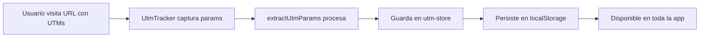

# Sistema de Tracking de UTM Parameters

## Descripción

Sistema global para capturar, almacenar y utilizar parámetros UTM en toda la aplicación. Los UTMs se persisten en `localStorage` y se mantienen durante toda la sesión del usuario, incluso al navegar entre páginas.

## Componentes

### 1. Store Global (`src/store/utm-store.ts`)

**Zustand store con persistencia en localStorage**

```typescript
import { useUtmStore } from "@/store/utm-store";

const { utmSource, utmMedium, utmCampaign, utmTerm, utmContent } = useUtmStore();
```

**Métodos disponibles:**

- `setUtmParams(params)` - Establece los parámetros UTM
- `clearUtmParams()` - Limpia todos los parámetros
- `hasUtmParams()` - Verifica si hay parámetros guardados

**Helper Functions:**

- `extractUtmParams(searchParams)` - Extrae UTMs de URLSearchParams
- `useInitializeUtms()` - Hook para inicializar UTMs en client components

### 2. Componente Tracker (`src/components/analytics/utm-tracker.tsx`)

**Captura automática de UTMs desde la URL**

- Se ejecuta en el layout principal
- Captura UTMs al cargar cualquier página
- Persiste los valores en el store global
- No interfiere con la UI (no renderiza nada)

## Formatos Soportados

El sistema busca UTMs en **dos formatos**:

| Formato Snake Case | Formato CamelCase | Campo en Store |
|-------------------|-------------------|----------------|
| `utm_source`      | `utmSource`       | `utmSource`    |
| `utm_medium`      | `utmMedium`       | `utmMedium`    |
| `utm_campaign`    | `utmCampaign`     | `utmCampaign`  |
| `utm_term`        | `utmTerm`         | `utmTerm`      |
| `utm_content`     | `utmContent`      | `utmContent`   |

## Ejemplos de URLs

### Formato con guiones bajos (estándar)
```
https://lokl.life/?utm_source=google&utm_medium=cpc&utm_campaign=verano2024
```

### Formato camelCase (alternativo)
```
https://lokl.life/?utmSource=facebook&utmMedium=social&utmCampaign=anuncio_verano
```

### Formato mixto (también funciona)
```
https://lokl.life/?utm_source=instagram&utmMedium=stories&utm_campaign=launch
```

## Flujo de Captura



## Integración con Simulaciones

Los UTMs se incluyen automáticamente al guardar simulaciones:

### Usuario Autenticado
```typescript
{
  email: "user@example.com",
  installments: 12,
  investmentValue: 5000000,
  // ... otros campos
  utmSource: "google",
  utmMedium: "cpc",
  utmCampaign: "verano2024",
  utmTerm: "inversion inmobiliaria",
  utmContent: "anuncio_1"
}
```

### Usuario No Autenticado (Lead)
```typescript
{
  name: "Juan Pérez",
  email: "juan@example.com",
  phone: "3001234567",
  // ... otros campos
  utmSource: "facebook",
  utmMedium: "social",
  utmCampaign: "launch",
  // ... más campos
}
```

## Uso en Componentes

### Leer UTMs
```tsx
"use client";

import { useUtmStore } from "@/store/utm-store";

export default function MyComponent() {
  const { utmSource, utmMedium, utmCampaign, hasUtmParams } = useUtmStore();
  
  if (hasUtmParams()) {
    console.log("Usuario vino desde:", utmSource);
  }
  
  return (
    <div>
      {utmSource && <p>Fuente: {utmSource}</p>}
    </div>
  );
}
```

### Establecer UTMs Manualmente
```tsx
"use client";

import { useUtmStore } from "@/store/utm-store";

export default function AdminPanel() {
  const { setUtmParams } = useUtmStore();
  
  const handleSetUtms = () => {
    setUtmParams({
      utmSource: "manual",
      utmMedium: "test",
      utmCampaign: "admin_test"
    });
  };
  
  return <button onClick={handleSetUtms}>Set UTMs</button>;
}
```

### Limpiar UTMs
```tsx
const { clearUtmParams } = useUtmStore();

// Al cerrar sesión, por ejemplo
const handleLogout = () => {
  clearUtmParams();
  // ... resto de lógica
};
```

## Persistencia

- **Almacenamiento**: `localStorage` con key `utm-storage`
- **Duración**: Hasta que el usuario limpie el navegador o se llame `clearUtmParams()`
- **Alcance**: Todo el dominio (todas las páginas de la app)

### Estructura en localStorage
```json
{
  "state": {
    "utmSource": "google",
    "utmMedium": "cpc",
    "utmCampaign": "verano2024",
    "utmTerm": "inversion",
    "utmContent": "banner_1"
  },
  "version": 0
}
```

## Casos de Uso

### 1. Attribution Marketing
```typescript
// Saber de dónde vienen los leads
const { utmSource, utmMedium } = useUtmStore();
console.log(`Lead desde ${utmSource} via ${utmMedium}`);
```

### 2. A/B Testing
```typescript
// Diferentes versiones de landing page
const { utmContent } = useUtmStore();
if (utmContent === "version_a") {
  return <LandingVersionA />;
} else {
  return <LandingVersionB />;
}
```

### 3. ROI por Canal
```typescript
// Al convertir, guardar con UTMs
await createLead({
  ...leadData,
  utmSource, // Para calcular ROI por canal
  utmMedium,
  utmCampaign
});
```

### 4. Personalización de Contenido
```typescript
// Mostrar contenido según la fuente
const { utmSource } = useUtmStore();

if (utmSource === "facebook") {
  return <WelcomeFacebookUsers />;
}
```

## Best Practices

### ✅ DO

- Capturar UTMs al inicio de la sesión
- Mantener UTMs durante toda la navegación
- Incluir UTMs en todos los formularios de conversión
- Usar para analytics y reporting

### ❌ DON'T

- No sobrescribir UTMs si ya existen (a menos que sean nuevos)
- No usar UTMs para información sensible
- No confiar en UTMs para autenticación
- No guardar datos personales en UTMs

## Debugging

### Ver UTMs actuales en consola
```typescript
const store = useUtmStore.getState();
console.log("UTMs:", {
  source: store.utmSource,
  medium: store.utmMedium,
  campaign: store.utmCampaign,
  term: store.utmTerm,
  content: store.utmContent,
  hasParams: store.hasUtmParams()
});
```

### Ver localStorage
```javascript
// En DevTools Console
console.log(JSON.parse(localStorage.getItem('utm-storage')));
```

### Limpiar manualmente
```javascript
// En DevTools Console
localStorage.removeItem('utm-storage');
```

## Configuración en Google Analytics

Para trackear estos UTMs en GA4:

1. Los UTMs se capturan automáticamente por GA4
2. Aparecerán en reportes bajo:
   - **Source/Medium**: `utm_source / utm_medium`
   - **Campaign**: `utm_campaign`
   - **Content**: `utm_content`
   - **Term**: `utm_term`

## Testing

### Test Manual
```bash
# Abrir en el navegador:
http://localhost:3000/?utm_source=test&utm_medium=manual&utm_campaign=dev_test

# Verificar en consola:
# 1. Buscar "UTM params capturados"
# 2. Verificar localStorage
# 3. Navegar a otra página y verificar que persisten
```

### URLs de Prueba

```
Landing Principal + Google Ads:
https://lokl.life/?utm_source=google&utm_medium=cpc&utm_campaign=brand&utm_term=lokl+inversion

Landing Principal + Facebook:
https://lokl.life/?utm_source=facebook&utm_medium=social&utm_campaign=launch&utm_content=video_1

Landing Principal + Email:
https://lokl.life/?utm_source=newsletter&utm_medium=email&utm_campaign=monthly&utm_content=cta_superior
```

## Schema Integration

Los UTMs están integrados en:

- ✅ `SaveSimulationGuestSchema` (usuarios no autenticados)
- ✅ `SaveSimulationAuthSchema` (usuarios autenticados)
- ✅ Todos los campos son **opcionales**
- ✅ Validación con Zod

## Endpoints API

Al guardar simulaciones, los UTMs se envían al backend:

```
POST /api/simulator/saveSimulation
```

**Body incluye (si existen):**
```json
{
  "email": "user@example.com",
  "projectId": "uuid",
  "investmentValue": 5000000,
  "utmSource": "google",
  "utmMedium": "cpc",
  "utmCampaign": "verano2024",
  "utmTerm": "inversion",
  "utmContent": "banner_1"
}
```

## Métricas y Analytics

Con este sistema puedes responder:

- 📊 ¿Qué canal trae más simulaciones?
- 💰 ¿Cuál es el ROI por campaña?
- 🎯 ¿Qué anuncios convierten mejor?
- 🔄 ¿Cuánto tiempo desde click hasta simulación?
- 📈 ¿Qué keywords generan más interés?

---

## Soporte

Para preguntas o issues sobre el sistema de UTMs, contactar al equipo de desarrollo.

